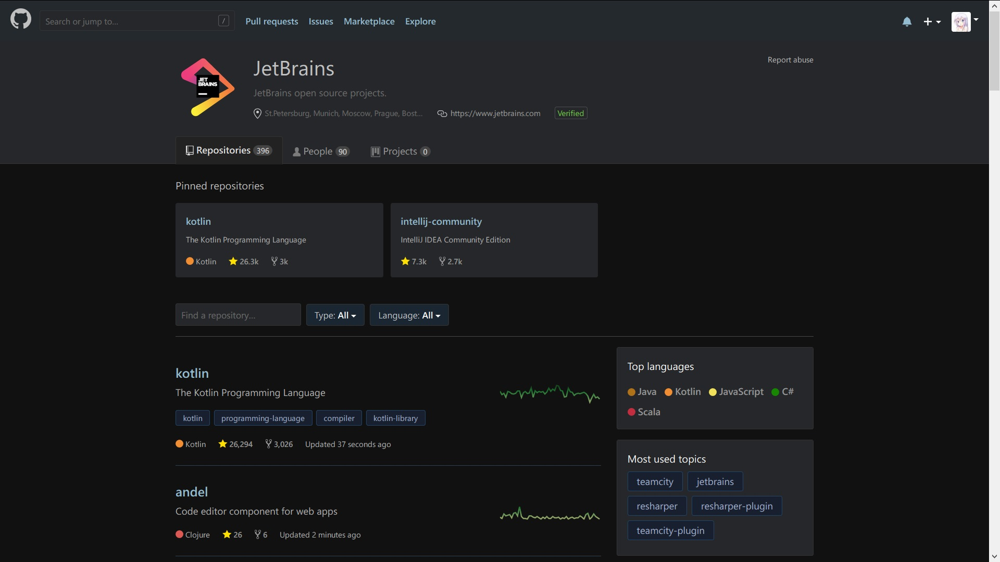
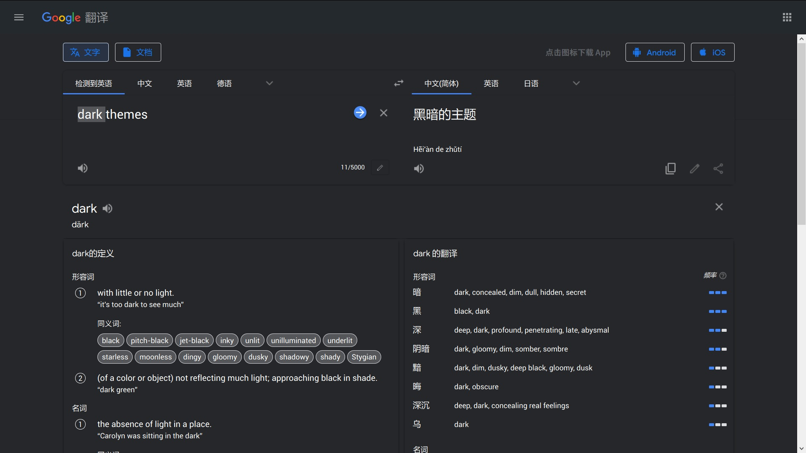
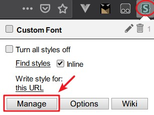
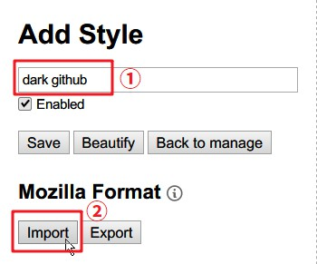
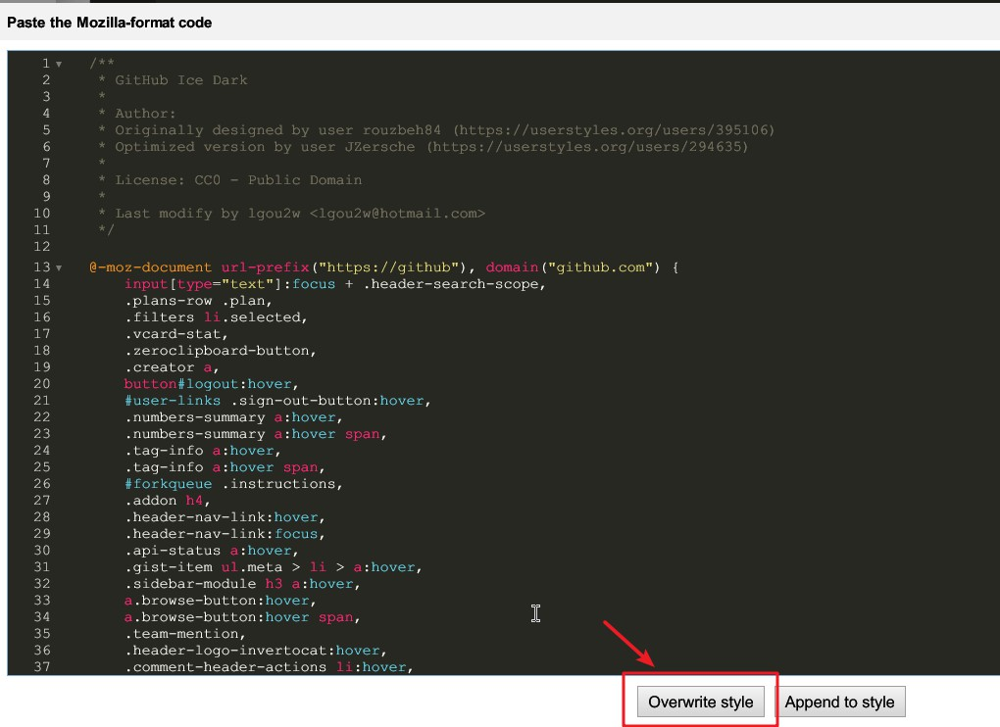
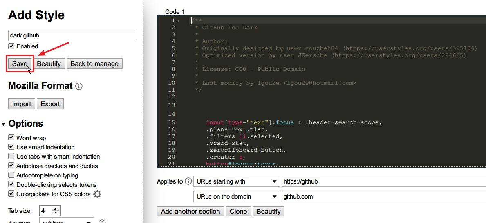

- [English](README.md)
- **简体中文**

# dark-themes
基于 Stylus 插件的黑暗主题样式集合

# 预览

点击预览

* 暗黑 GitHub

* 暗黑谷歌翻译 (CN)

# 如何使用 ?

1. 给您的浏览器安装 `stylus` 扩展插件: [Firefox](https://addons.mozilla.org/en-US/firefox/addon/styl-us/), [Chrome](https://chrome.google.com/webstore/detail/stylus/clngdbkpkpeebahjckkjfobafhncgmne)
2. 打开扩展插件的管理面板:

3. 写一个新的样式:

4. 输入样式名称并点击导入按钮:

5. 复制项目的 CSS 样式文件的内容并粘贴到输入框内点击重写按钮:

6. 保存这个样式:

7. 享受吧.
