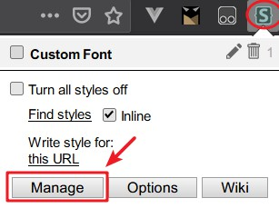
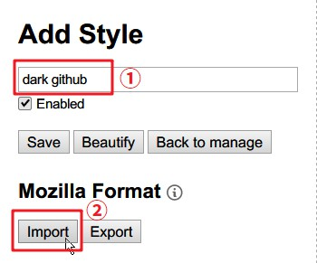
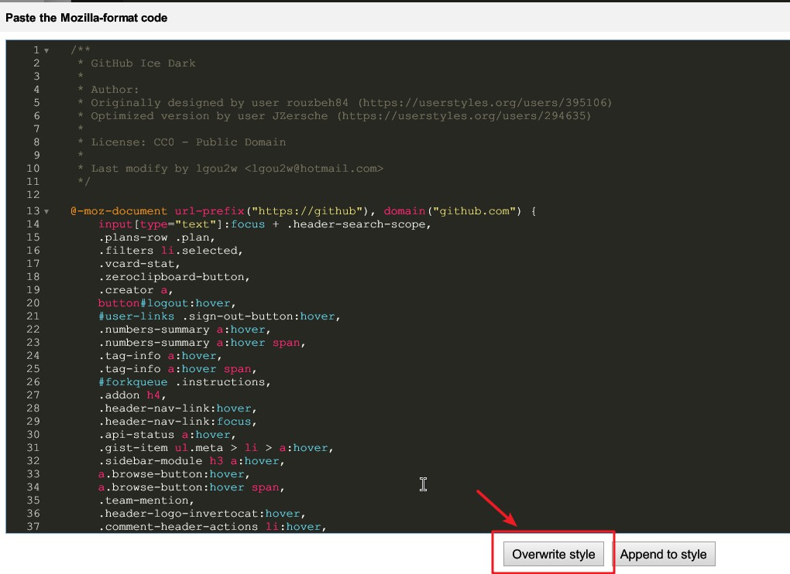
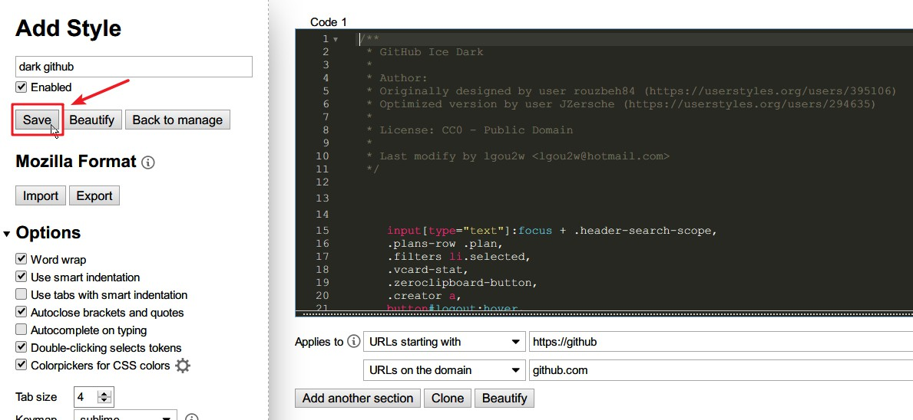

- **English**
- [简体中文](README-CN.md)

# dark-themes
A dark theme style collection based on stylus plugin

# Preview

Click preview

* Dark GitHub

* Dark Google Translate (CN)

# How to use ?

1. Install the `stylus` extension for your browser: [Firefox](https://addons.mozilla.org/en-US/firefox/addon/styl-us/), [Chrome](https://chrome.google.com/webstore/detail/stylus/clngdbkpkpeebahjckkjfobafhncgmne)
2. Open the extension's manage panel: 

3. Write a new style: 

4. Enter the style name and click the Import button: 

5. Copy the contents of the project's CSS style file and paste it into the input box. Click the override button: 

6. Save this style: 

7. Enjoy it.
